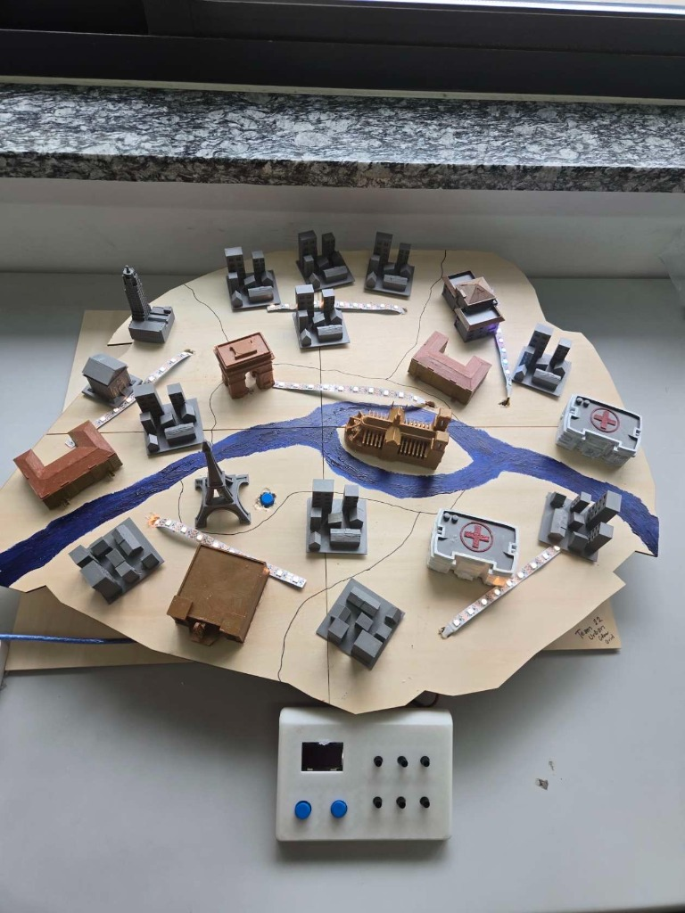
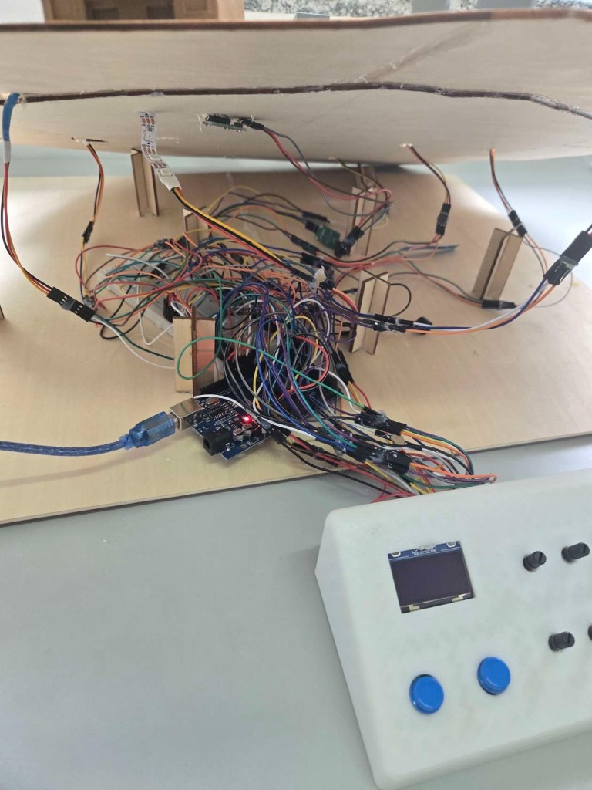

# 🗼 Urban Glow Grid — Project Documentation

Welcome to the official repository of **Urban Glow Grid** (Team 22). This project was created to fight **"Energy Blindness"** — the invisible nature of our daily energy consumption. 

Urban Glow Grid is a **physical, interactive 1:15,000 scale model of Paris** that gamifies electrical grid management. Players act as Chief Engineers, physically manipulating dials and switches to balance grid loads, prevent blackouts, and learn key sustainable energy principles in real-time.

---

## 📸 Mockup & Hardware Overview

Below is the visual structure of the physical prototype and the challenges encountered during fabrication:

* **Paris Scale Model (Overview)**: Physical wood model split into 6 key energy zones with 3D-printed translucent landmarks (Eiffel Tower, Louvre, Arc de Triomphe) diffusing NeoPixel LED light.
  
* **Wiring Under the Hood (Challenges)**: A look at the electronics layer managing nearly 90 jumper wires, showing the physical complexity and loose connections we resolved by separating structural components from the circuitry.
  

---

## 📂 Repository Directory Structure

To help future developers take over and scale this project, here is how the files are organized:

* `arduino/`
  * [`urban_glow_grid_mega_final/`](file:///Users/Abir/Desktop/innovation%20project/arduino/urban_glow_grid_mega_final): The production code uploaded to the Arduino Mega managing inputs/outputs.
  * `mega_hardware_test/`: Simple test scripts to isolate issues with OLED, LEDs, dials, or buttons.
  * [`wiring_guide.pdf`](file:///Users/Abir/Desktop/innovation%20project/arduino/wiring_guide.pdf): Detailed electrical connection blueprint.
* `simulation/`
  * [`Urban_GlowGrid_Simulator.html`](file:///Users/Abir/Desktop/innovation%20project/simulation/Urban_GlowGrid_Simulator.html): Browser-based web visualizer for the grid status.
  * [`mock_websocket_server.py`](file:///Users/Abir/Desktop/innovation%20project/simulation/mock_websocket_server.py): Python server to stream grid load rates into the simulator.
* `pdf_generator/`
  * [`final_presentation.html`](file:///Users/Abir/Desktop/innovation%20project/pdf_generator/final_presentation.html): HTML source for the presentation slide deck.
  * [`oral_script.html`](file:///Users/Abir/Desktop/innovation%20project/pdf_generator/oral_script.html): HTML source for the 3-minute oral presentation script.
  * Scripts to automate PDF compiling (`generate_final_presentation_pdf.py`, `generate_manual_pdf.py`, etc.).
* `image/`: Photos used in presentations, manual, and this documentation.
* `scale up/`: Canvas files and diagrams planning the transition to a mass-market product.

---

## 🛠 Hardware Architecture & Bill of Materials (BOM)

The physical maquette separates the **wooden layout structure** from the **electronics layer** to allow easy, non-destructive wiring iterations. 

### Key Components:
1. **Microcontroller**: Arduino Mega 2560 (selected for its high pin count to drive multiple parallel sensors/LEDs).
2. **Visual Indicators**: 6 WS2812B NeoPixel strips (underneath landmarks) + I2C SSD1306 OLED Display (shows real-time numeric load metrics).
3. **Control Interface**: 6 Potentiometers (load balancing dials) + 4 tactile Push Buttons (priority building toggles) + 1 Master Reset Button.
4. **Audio Feedback**: 8-ohm Speaker/Buzzer (emits blackout warning alarms).
5. **Physical Enclosure**: Laser-cut plywood baseboard, translucent PLA 3D-printed landmarks.

### Sourcing & Cost Breakdown (Strictly < 200 RMB)

| Component | Qty | Function | Est. Cost (RMB) |
| :--- | :---: | :--- | :---: |
| **Arduino Mega 2560** | 1 | Central Processing Unit | 45.00 |
| **WS2812B LED Strips** | 6 | Paris Zone status lights (Green/Red) | 30.00 |
| **OLED Display (I2C SSD1306)** | 1 | Real-time system display screen | 15.00 |
| **Potentiometers (Dials)** | 6 | Local load adjustment controls | 12.00 |
| **Push Buttons (Toggles)** | 4 | Priority building power overrides | 4.00 |
| **Speaker / Buzzer** | 1 | Audio blackout alarms | 5.00 |
| **Physical Materials** | — | Laser-cut plywood, 3D printing PLA, glue, screws | 80.00 |
| **TOTAL** | | | **~191.00 RMB** |

---

## 💻 Software Setup & Installation

### 1. Arduino Code Deployment
Open the [production code](file:///Users/Abir/Desktop/innovation%20project/arduino/urban_glow_grid_mega_final/urban_glow_grid_mega_final.ino) in the Arduino IDE. 

Make sure you have installed the following libraries via the Arduino Library Manager:
* **Adafruit_NeoPixel** (to control the WS2812B LEDs)
* **SSD1306Ascii** (lightweight text-only library to control the OLED screen without overloading SRAM)

Compile and upload the project onto your Arduino Mega.

### 2. Running the Web Simulator
To visualize grid activity on a computer screen alongside the physical model, run our local simulator:

1. Open your terminal in the project directory.
2. Activate the python virtual environment:
   ```bash
   source venv/bin/activate
   ```
3. Run the mock server (starts a WebSocket at `ws://localhost:8080` to broadcast sensor fluctuations):
   ```bash
   python simulation/mock_websocket_server.py
   ```
4. Double-click to open [`simulation/Urban_GlowGrid_Simulator.html`](file:///Users/Abir/Desktop/innovation%20project/simulation/Urban_GlowGrid_Simulator.html) in any browser. It will connect automatically and show live zone balancing.

---

## 🕹 Game Rules & Playbook

The game simulates a peak winter day. The player has **3 minutes** to maintain the stability of the Paris electrical grid.

1. **Balance the Grid**: Dials (potentiometers) represent zone power. When a zone turns **red** (overloaded), you must rotate the dial to decrease non-essential load.
2. **Prioritize Buildings**: Tactile buttons allow you to route power away from residential blocks to vital sectors (like hospitals or water systems) during heavy strain.
3. **Avoid Blackout**: The OLED screen shows total system capacity. If the total load exceeds 95%, the buzzer sounds a warning. If it hits 100% for more than 5 consecutive seconds, a **Blackout** is triggered: all LEDs flash red, the game resets, and you lose.
4. **Victory Condition**: Maintain system stability until the timer expires.

---

## 🚀 Future Roadmap & Developer Notes

If you are resuming this project, here are the critical steps required to turn this prototype into a commercial product:

* **Transition to Custom PCB**: The biggest hardware challenge was **Loose Connections** (wires coming loose from the breadboards due to physical vibration). Designing a dedicated Printed Circuit Board (PCB) to replace jumper wires will reduce assembly time by 95% and make the product robust enough for shipping.
* **Scale Software Architecture**: The current C++ simulation is optimized for Paris (6 zones). The code is structured modularly so you can swap out the geographic layout files (`paris_map_data.js` and LED indices) to model cities like **London, Tokyo, or New York**.
* **Transition to B2B Educational Kits**: The low BOM (< 200 RMB) makes this highly profitable. Next phases should package the PCB, components, and a flat-packed wooden box as a "build-your-own smart city kit" for EdTech classrooms.

---

## 👥 The Team (Team 22)
* **Abir ISLAM** — CEO / Project Lead
* **Sofiane LACHHAB** — CTO / Architecture
* **Mohamed MELLOUK** — Creative Director
* **Ismail MABROUKI** — Hardware Support
